# Manual de Usuario 

## Panel de administración general
 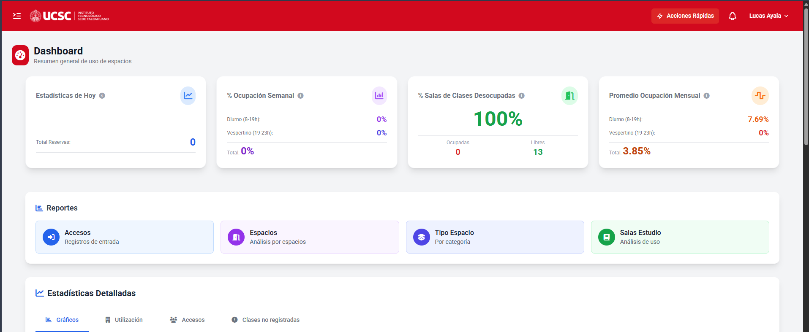

### Estadísticas.
 En tanto inicie sesión podrá ver en pantalla una serie de estadísticas asociadas a su sede, en donde podrá ver distintos KPI's, en formato de tarjeta, si usted posa el mouse sobre el indicador de información ( _i_ ) se desplegará un dialogo hover que muestra como se calcula la estadística asociada.

 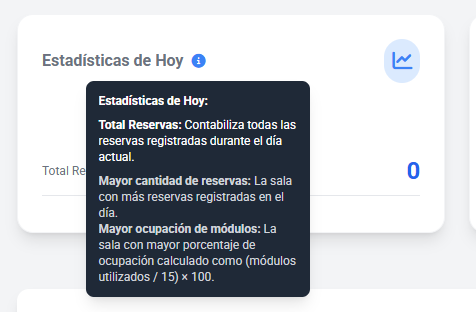 

 Los KPI's disponibles en la versión 2.0 son:

 -Total de reservas y sala de clases más utilizada
 - % de ocupación semanal separado por jornada diurno y vespertino considerando sábado como medio dia.
 - % de Salas desocupadas *actualmente*, junto con el numero de salas ocupadas y disponibles.
 - Promedio de ocupación mensual separado por jornadas
 
### Accesos Directos.
En el bloque de reportes existen 4 botones que le llevarán a una nueva página de la plataforma en donde podrá ver de manera detallada la reportería seleccionada. Existen 4 tipos de reportes:
- Accesos: Útil para llevar un registro de quién pidió un determinado espacio.
- Espacios: Entrega un análisis de uso por espacio.
- Tipo de Espacio: Análisis por tipo de espacio.
- Salas de Estudio: Informes de uso de las salas de estudio.

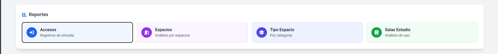

### Estadísticas Detalladas.
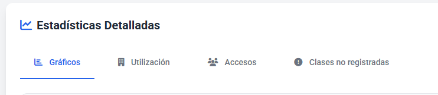
En esta sección puede consultar información detallada de 4 tópicos. Los cuales veremos detalladamente a continuación:
- Gráficos generalizado para Ocupación por día, reservas por salas, Cantidad de Reservas por Día, Disponibilidad de Salas.

Puede consultar gráficos que se actualizan en tiempo real con la información anteriormente mencionada y filtrarlos por un periodo en especifico:
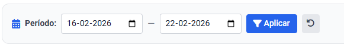
En el campo de fecha izquierdo puede elegir el inicio de los datos y en el campo derecho el termino de los datos, esto se reflejará en cada gráfico en tanto pulse el botón "Aplicar". Puede restablecer para considerar la semana actual si pincha en el botón con el icono "Restablecer".

Gráficos con categorías:
Ciertos gráficos tienen la opción de activar diversas vistas de un tipo de información.
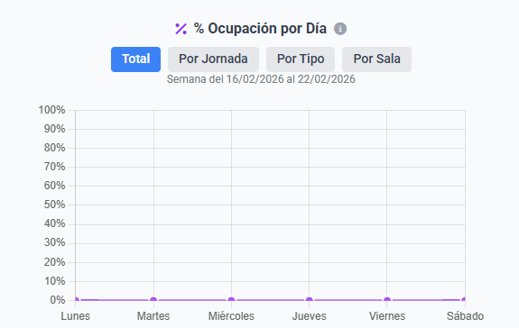
En color azul es la vista que está activada, y en color gris claro son otras vistas disponibles que al momento de pulsarlas se activarán junto con el gráfico en sí.
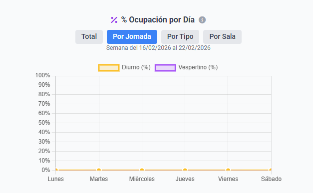

Note como en los ejempos anteriores los rótulos indican diferentes datos de la ocupación por día, en la primera imagen no existe ningún rótulo del gráfico ya que indica información de ocupación por día de manera *general*, pero en la segunda imagén al tener activada la opción "Por Jornada" se activan los rótulos "Diurno" y "Vespertino" asociados a los colores naranja y morado, respectivamente.

Usted puede hacer zoom en los gráficos utilizando la rueda de su ratón para facilitar su análisis. O de manera alternativa si esta desde una laptop o notebook, puede hacer el gesto de "Agrandar" en el trackpad para realizar la misma función.

- Utilización
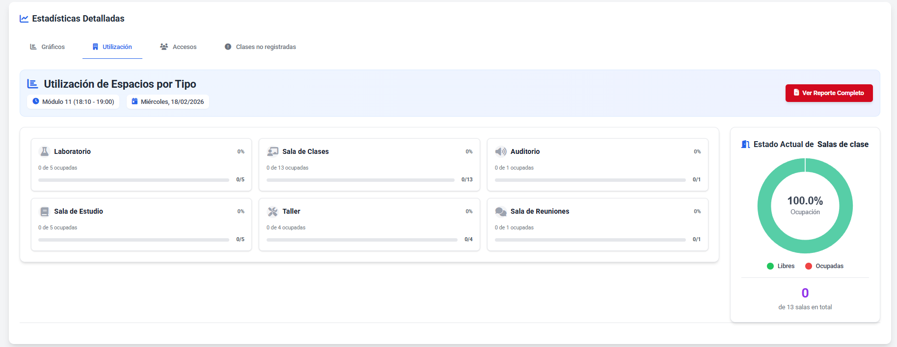
En esta pestaña usted puede ver en tiempo real el *porcentaje de ocupación de cada tipo de espacio* junto con la cantidad de espacios ocupados asociados y su total.    
Además puede consultar el reporte completo accediendo a la página de reportes desde el botón de la derecha superior.

- Accesos
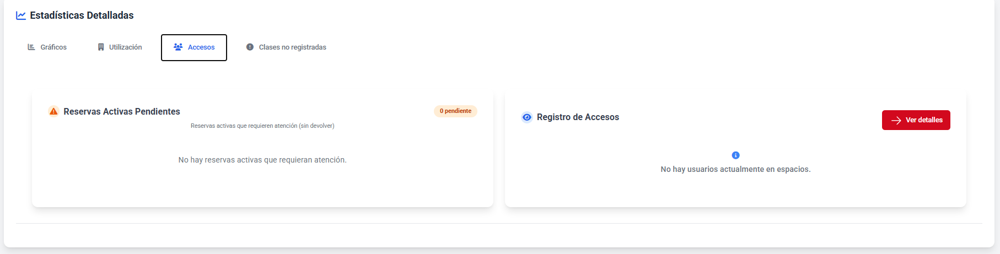

En la pestaña accesos existen 2 paneles, el izquierdo muestra las reservas activas que están *pendientes de devolución* y en la derecha usted puede consultar todos los útlimos accesos registrados, si pulsa el botón "Ver detalles" puede acceder a los reportes de accesos completos.

- Clases no registradas

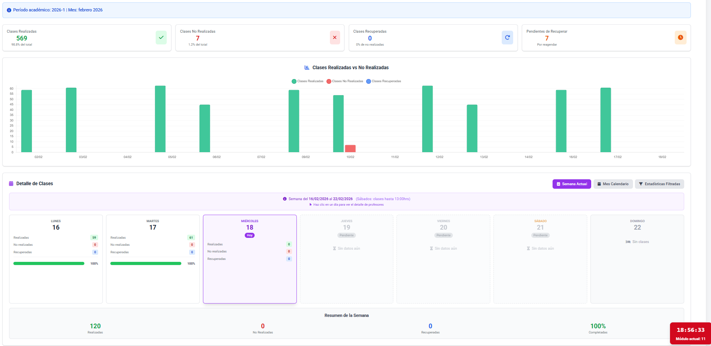
En clases no registradas usted puede acceder a un reporte gráfico de todas las clases *realizadas, no realizadas, clases recuperadas y clases pendientes de recuperar*, puede consultarlo desde su respectiva tarjeta KPI, y de manera visual desde el gráfico de barras. Además se entrega un resumen por día y semana actual con la información anteriormente mencionada.

Al pulsar en un día, puede consultar información detallada de las clases que no se realizaron ese día en particular, como se logra observar en la imagen.
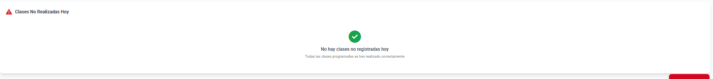

Si usted mira con atención podrá notar que las vistas pueden alternarse, en la posición superior derecha del bloque "Detalle de Clases" puede iterar en _Semana Actual, Mes Calendario y Estadísticas Filtradas_
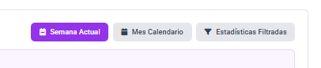

En mes calendario puede consultarse información de todo el mes de manera detallada como se observa en la siguiente imagen:
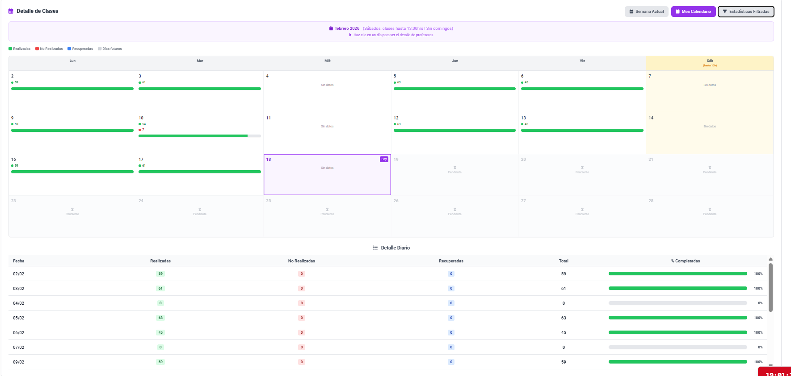

Mientras que en estadísticas filtradas se permite elegir una fecha de inicio (izquierda) y una fecha de término de las estadísticas (derecha), estos límites se aplicarán en tanto usted pulse el botón "Filtrar"

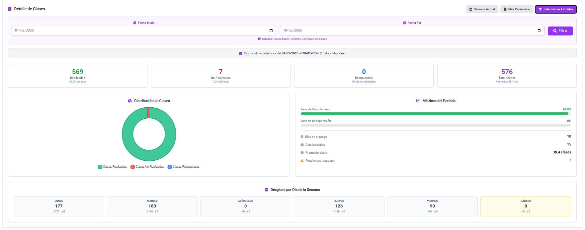

### Horarios del día - Módulos Actuales

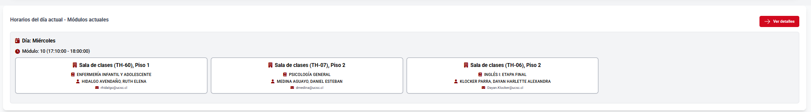

Debajo del bloque de estadísticas Detalladas, usted podrá ver que clases deben impartirse en el módulo actual. La información incluye: Espacio a utilizar, Asignatura programada y finalmente el docente encargado de impartir esa asignatura y su respectivo correo para facilitar contacto. Puede consultar más información si pulsa en "Ver detalles".

### Clases no realizadas hoy.

Similar al bloque anterior usted puede ver con la misma información mencionada recientemente las *clases que no se registraron* durante el día actual.