# Manual de Usuario 

## Navegación
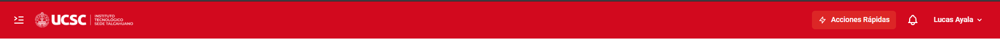
La barra superior le permite gestionar su sesión y acceder a herramientas rápidas desde cualquier sección. Componentes:

### Identidad Institucional
El logotipo a la izquierda redirige al Dashboard principal.

### Panel de Navegación Lateral (Colapsado)
Haga clic en este botón para expandir el menú lateral.

### Panel de Navegación Lateral (Expandido)
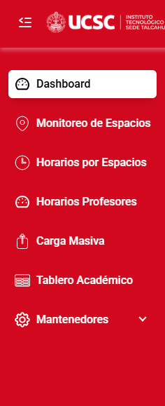
El menú lateral permite navegar por los módulos del SIA | Sistema de Información de Aulas:

- Dashboard: Pantalla de inicio con la visión general y métricas de la sede.
- Monitoreo de Espacios: Visualización en tiempo real del uso de salas y laboratorios. Permite reservar mediante código QR.
- Horarios por Espacios: Consulta de horarios de cada espacio.
- Horarios Profesores: Agenda de docentes para coordinar actividades.
- Carga Masiva: Importación de datos (Solo para perfiles técnicos).
- Tablero Académico: Información administrativa y académica para directivos.
- Mantenedores: Opciones de configuración base del SIA | Sistema de Información de Aulas (Solo para perfiles técnicos).

### Acciones Rápidas
Botón para realizar reservas y enviar espacios a mantención.

### Centro de Notificaciones
Avisos sobre eventos, actualizaciones o estado de cargas de datos.

### Menú de Perfil de Usuario
Muestra el nombre del usuario activo. Opciones:
- Perfil: Detalles de la cuenta.
- Cambiar Sede: Cambiar la sede que administra.
- Ayuda: Documentación de soporte.
- Contactar Soporte: Reportar incidencias.
- Cerrar Sesión: Finaliza la sesión de forma segura.

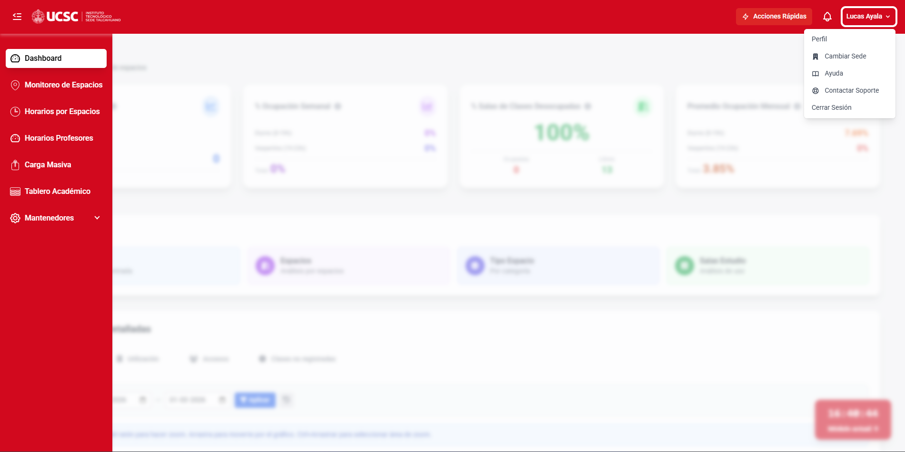

## Panel de administración general
 

### Estadísticas
Al iniciar sesión verá indicadores (KPIs) de su sede. Pase el mouse sobre el ícono de información ( _i_ ) para ver cómo se calculan.

  

Indicadores disponibles:
- Total de reservas y sala más utilizada.
- % de ocupación semanal (diurno y vespertino).
- % de salas desocupadas actualmente.
- Promedio de ocupación mensual por jornadas.
 
### Accesos Directos
Acceso a 4 reportes detallados:
- Accesos: Registro de quién solicitó los espacios.
- Espacios: Análisis de uso por espacio.
- Tipo de Espacio: Análisis según el tipo de espacio.
- Salas de Estudio: Informes sobre salas de estudio.

### Estadísticas Detalladas

Consulte información gráfica de:
- Ocupación por día, reservas por salas y disponibilidad.

Puede filtrar los gráficos por fecha usando el panel superior y hacer clic en "Aplicar".

Gráficos con categorías:

Algunos gráficos tienen varias vistas. Las vistas activas aparecen en azul.

Puede hacer zoom en los gráficos usando la rueda del ratón o el gesto en el trackpad.

- Utilización

Muestra el porcentaje de ocupación en tiempo real por tipo de espacio.

- Accesos

Panel con reservas activas (pendientes de devolución) y los últimos accesos registrados.

- Clases no registradas

Reporte de clases realizadas, no realizadas y recuperadas.
Al pulsar en un día en el gráfico, verá el detalle de las clases no realizadas de ese día:

Puede alternar entre la semana actual, mes calendario o fechas filtradas:

### Horarios del día - Módulos Actuales

Muestra las clases del módulo actual, el docente y su correo de contacto.

### Clases no realizadas hoy

Muestra las clases que no se registraron durante el día en curso.

## Acciones Rápidas
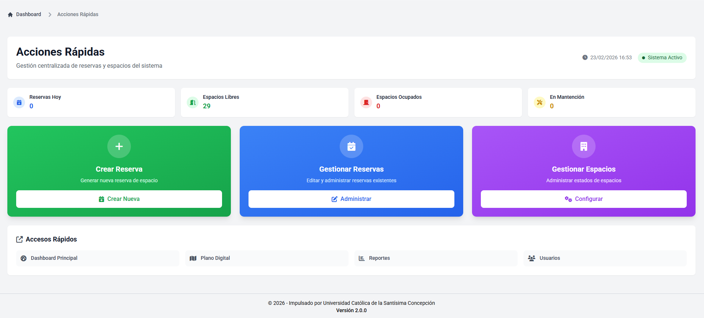
Interfaz para realizar tareas críticas del día a día.

### Resumen de Disponibilidad en Tiempo Real
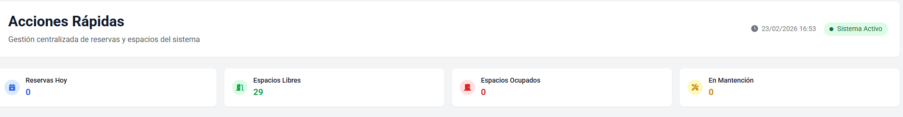
- Reservas Hoy: Total de reservas programadas.
- Espacios Libres: Salas disponibles para uso inmediato.
- Espacios Ocupados: Salas con actividad en curso.
- En Mantención: Espacios inhabilitados.

### Panel de Gestión Directa
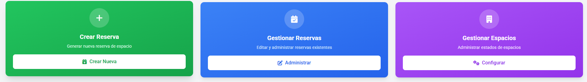
- Crear Reserva: Nueva asignación de espacio.
- Gestionar Reservas: Editar, reasignar o cancelar reservas.
- Gestionar Espacios: Cambiar el estado de los espacios.

### Accesos Rápidos Complementarios
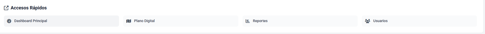
Enlaces al Plano Digital, reportes y administración de usuarios.

## Creación de Reserva Manual
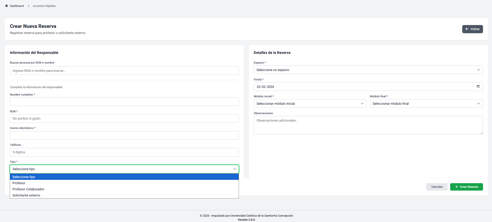
Para reservar un espacio manualmente:

### Acceso al Formulario
En "Acciones Rápidas", haga clic en "Crear Nueva" dentro de la tarjeta "Crear Reserva".

### Información del Responsable
- Busque al solicitante por RUN o nombre, o ingrese sus datos obligatorios (Nombre, RUN, Correo, Teléfono).
- Seleccione el tipo de solicitante (Profesor o Externo).

### Detalles de la Reserva
- Elija el espacio y la fecha.
- Seleccione el módulo inicial y final.
- Agregue observaciones si es necesario.

### Finalización del Registro
Haga clic en "Crear Reserva" para guardar. 
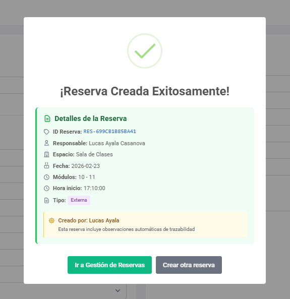

## Gestión de reservas
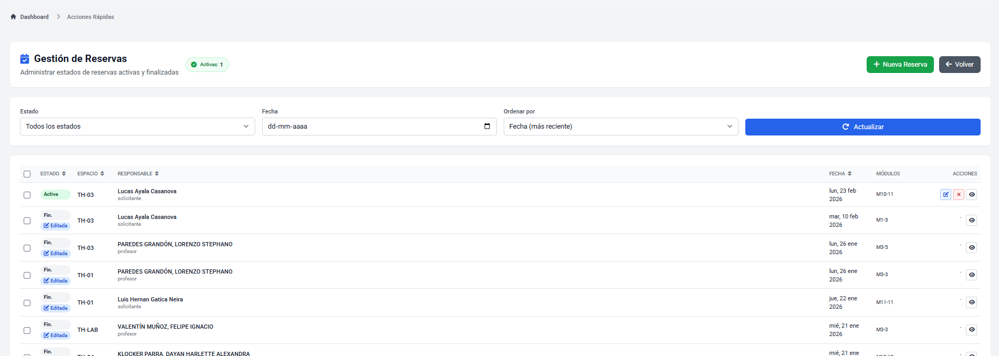
Controle todas las reservas de la sede.

### Filtros y Organización de Datos
Puede filtrar por Estado y Fecha, ordenar los datos, y actualizar la vista.

### Visualización de la Tabla de Registros
La tabla detalla el estado, espacio, responsable, fecha y módulos de cada reserva.

### Acciones de Administración
- **Editar**: Modificar una reserva activa.
- **Cancelar**: Eliminar la reserva y liberar el espacio.
- **Ver detalles**: Ver información extendida.

Desde aquí también puede usar "+ Nueva Reserva".

## Gestión de Espacios
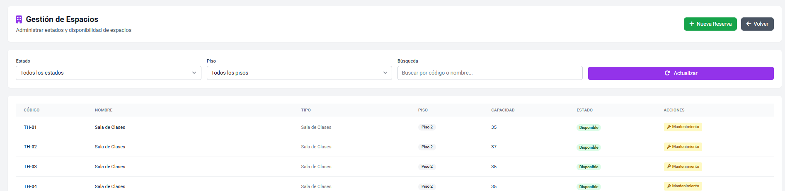
Controle el estado operativo de los espacios.

### Herramientas de Filtrado y Búsqueda
Filtre por estado, piso o busque por código de sala.

### Control de Mantenimiento
- **Mantenimiento**: Inhabilita el espacio para reservas.
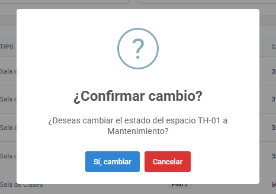
- **Liberar**: Cambia el espacio a "Disponible".
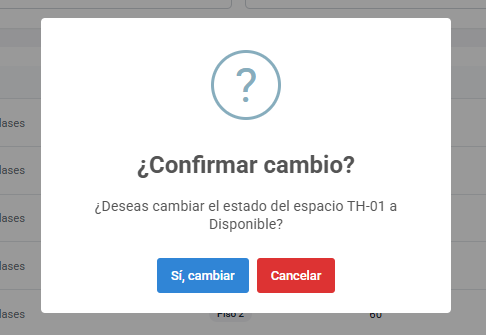
 _Nota_: Puede liberar un espacio físicamente desocupado que tenga reserva activa, pero no eliminará la reserva. 
 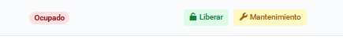

## Plano Digital
### Acceso al Plano Digital
El Plano Digital permite ver los espacios y reservar escaneando códigos QR.

### Procedimiento de Reserva mediante Código QR
1. Localice el espacio en el Plano Digital.
2. Escanee la cédula de identidad del responsable.
3. Escanee el código QR del espacio.
4. El sistema confirmará la reserva en pantalla.

### Procedimiento de Reserva para Solicitantes No Registrados
1. Identifique el espacio.
2. Escanee su cédula de identidad.
3. Complete el formulario con sus datos.
4. Escanee nuevamente su cédula y luego el código QR del espacio.

### Procedimiento para Devolución de un Espacio
1. Localice el espacio ocupado.
2. Escanee la cédula del responsable.
3. Escanee el código QR del espacio para liberarlo.

### Procedimiento de Reserva de Salas de Estudio
Las salas de estudio permiten registrar a un grupo completo:
1. Haga clic en la sala de estudio en el plano.
2. Escanee la cédula del **responsable** del grupo.
3. Ingrese los nombres y RUN de los demás asistentes.
4. Escanee el código QR de la sala.
El sistema confirmará el registro de asistencia de todo el grupo.

#### Devolución de Sala de Estudio
1. Escanee la cédula del **responsable** (el que hizo el registro inicial).
2. Escanee el código QR de la sala.
El sistema marcará la salida de todos y liberará la sala.

## Clases temporales, reforzamientos, cursos y eventos
Para crear actividades temporales:
1. En **Control docente**, seleccione **Clases temporales** y "Nueva asignatura temporal".
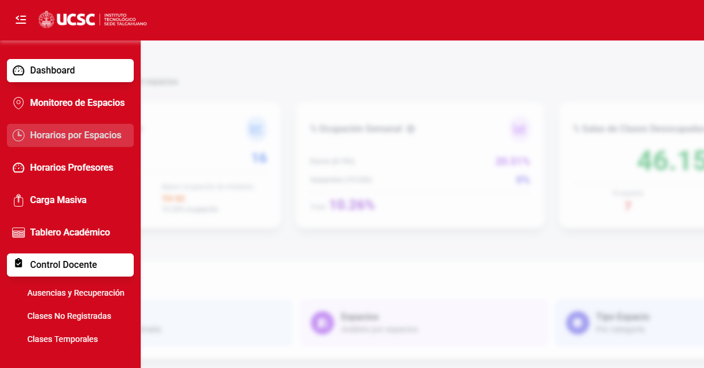
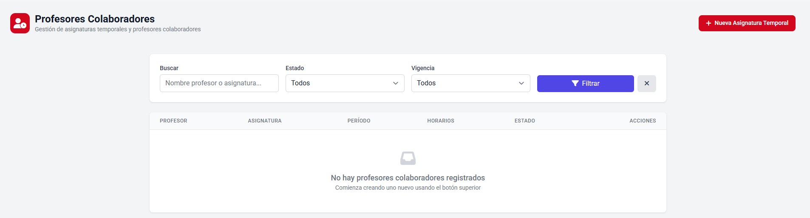
2. Busque o ingrese los datos del docente.
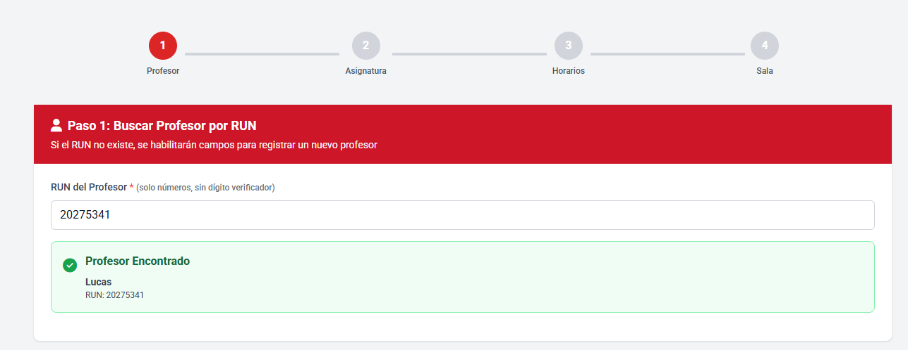
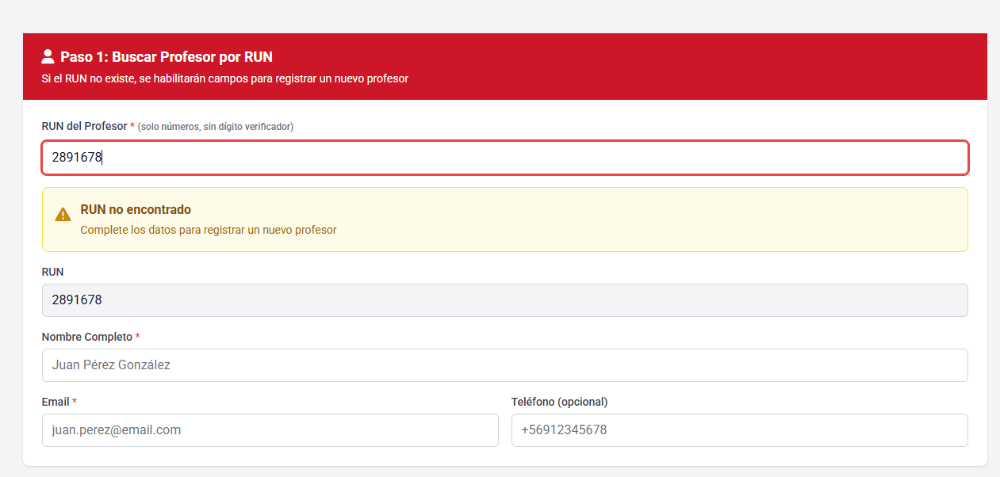
3. Defina los datos de la actividad y sus bloques horarios.
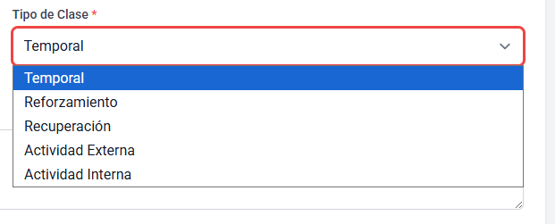
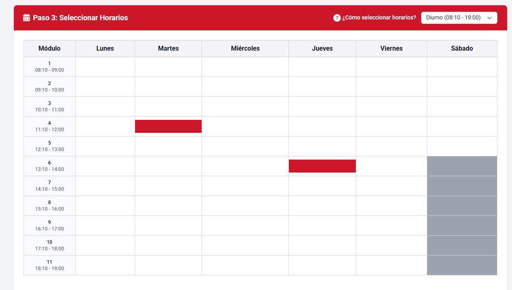
4. Seleccione un espacio disponible (salas de clases, auditorios, etc.).
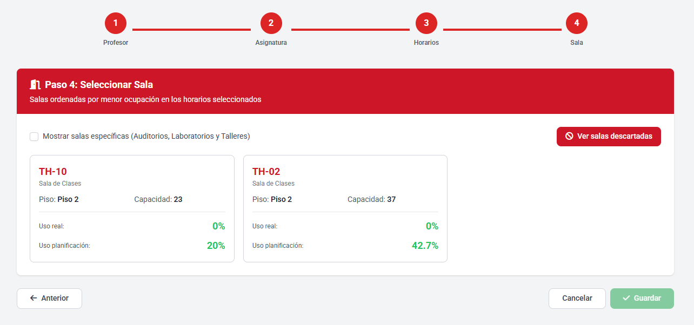
5. Guarde y confirme la reserva temporal.

## Ausencias y Recuperación de Clases
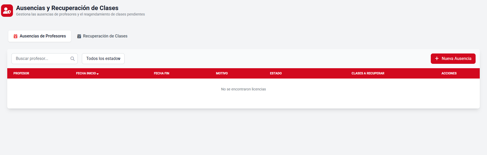

1) Registrar una nueva ausencia
Haga clic en **Nueva Ausencia**, complete los datos del docente, fechas y motivos. El SIA | Sistema de Información de Aulas liberará las clases afectadas.

2) Gestionar una ausencia existente
Desde la tabla puede editar o cancelar registros de ausencias.

3) Planificar o revisar recuperaciones
En la pestaña **Recuperación de Clases**, puede reagendar las sesiones afectadas asignando nuevos espacios y horarios.
