# Manual de Usuario Oficial — AulaSync | Sistema de Información de Aulas (SIA)

Bienvenido a la documentación oficial y guía de usuario de **AulaSync (SIA)**. Esta guía está diseñada para orientar a administradores, supervisores, coordinadores académicos y personal de recepción en todas las operaciones del sistema.

---

## 1. Introducción y Acceso al Sistema

AulaSync es la plataforma integral para la gestión, monitoreo en tiempo real, reserva de espacios físicos y control de asistencia docente y estudiantil de la institución.

### Perfiles y Roles de Usuario

El sistema dispone de roles con permisos diferenciados:
* **Administrador:** Acceso completo a todas las funciones, mantenedores estructurales, carga masiva, auditoría, configuración y soporte.
* **Supervisor:** Supervisión operativa de sede, control de reservas, visualización del dashboard, reportes, control docente y acciones rápidas.
* **Control Docente:** Gestión directa del flujo de salas, ausencias, reprogramación de clases y monitoreo del plano digital.
* **Profesor / Usuario:** Consulta de horarios personales, estado de espacios y descarga de comprobantes.

---

### Inicio de Sesión y Selección de Sede

1. Ingrese con sus credenciales institucionales (Correo electrónico y contraseña).
2. Si su perfil tiene asignada la administración de múltiples sedes, el sistema le presentará la pantalla de **Selección de Sede** para determinar el contexto operativo de trabajo.
3. Una vez seleccionada la sede, accederá al entorno correspondiente con aislamiento completo de espacios, horarios y docentes.

---

### Barra de Navegación Superior

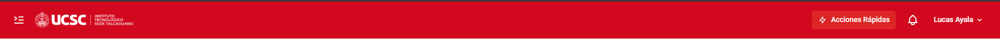

La barra superior permanece accesible en todo momento y contiene:
* **Identidad Institucional:** El logotipo superior izquierdo le permite regresar de inmediato al Dashboard principal.
* **Botón de Menú:** Permite expandir o colapsar el panel de navegación lateral.
* **Acciones Rápidas:** Botón de acceso directo para resolver tareas operativas inmediatas.
* **Centro de Notificaciones:** Avisos en tiempo real sobre el estado de la sede, alertas de horarios y confirmaciones.
* **Menú de Perfil de Usuario:** 
  
  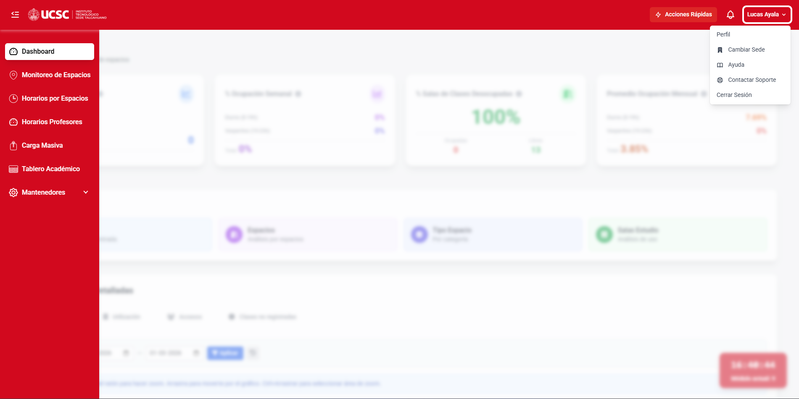
  
  Permite consultar los datos de la cuenta activa, cambiar de sede de trabajo, acceder al centro de ayuda, contactar a soporte técnico o cerrar sesión de forma segura.

---

## 2. Monitoreo en Tiempo Real y Plano Digital

El **Plano Digital** es el corazón visual de AulaSync. Permite ver la ocupación física de las instalaciones en tiempo real con actualización instantánea mediante WebSockets.

### Panel de Navegación Lateral

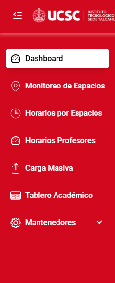

A través del panel lateral puede acceder a los distintos módulos del sistema:
* **Dashboard:** Resumen analítico y métricas de la sede.
* **Monitoreo de Espacios (Plano Digital):** Estado interactivo de salas, laboratorios y auditorios.
* **Horarios por Espacios:** Grilla horaria de ocupación de cada sala.
* **Horarios Profesores:** Agenda y carga horaria de cada docente.
* **Control Docente:** Gestión unificada de ausencias y recuperación de clases.
* **Carga Masiva:** Importación de planificaciones académicas vía Excel.
* **Mantenedores:** Configuración de la estructura institucional y física.

---

### Visualización del Plano Digital

El plano representa fielmente los edificios y pisos de la sede:
* **Filtros por Facultad / Edificio y Piso:** Permite conmutar la vista por niveles.
* **Estados Visuales de los Espacios:**
  * **Verde (Disponible):** El espacio está libre y listo para su uso.
  * **Rojo (Ocupado):** Espacio en uso con clase o reserva vigente.
  * **Amarillo (Reservado):** Espacio programado para el módulo actual en espera de ingreso.
  * **Gris / Naranjo (Mantenimiento):** Inhabilitado temporalmente por servicios o reparaciones.

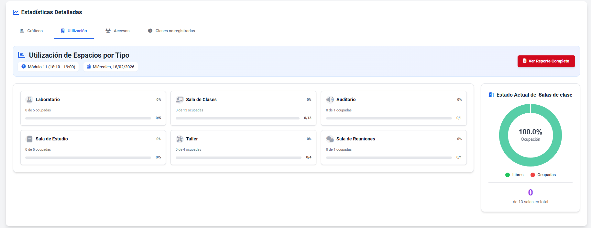

---

### Liberación y Cierre Forzado de Espacios Retenidos

Si un docente finaliza su clase pero no entrega la llave en recepción, o si una sala figura ocupada indebidamente:
1. Haga clic sobre el espacio en el Plano Digital o en el listado de espacios.
2. Seleccione la opción **Liberar Espacio / Forzar Cierre**.
3. El sistema cerrará la sesión anterior y devolverá el espacio al estado **Disponible**, notificando en tiempo real a todos los puestos de recepción.

---

### Pantalla Pública: Módulos Actuales

Para pantallas informativas ubicadas en pasillos, accesos y tótems, AulaSync dispone de una vista pública optimizada (`/modulos-actuales`):
* Muestra las clases que se están impartiendo en el bloque horario en curso.
* Detalla la asignatura, el docente a cargo y la sala asignada.
* Se refresca automáticamente sin requerir intervención manual ni inicio de sesión.

---

## 3. Control de Asistencia y Códigos QR

AulaSync integra un flujo automatizado de control de acceso y asistencia basado en lectores de códigos QR y cédulas de identidad.

### Apertura y Devolución de Salas (Docentes)

#### Procedimiento para Apertura de Sala
1. El docente se presenta en recepción o ante el tótem lector.
2. Se escanea la cédula de identidad o el **QR Personal** del docente.
3. Se escanea el código QR de la sala o se confirma la entrega de llave en pantalla.
4. El sistema valida si el docente tiene clase planificada en ese módulo:
   * Si tiene clase asignada, se valida la asistencia y la sala pasa a estado **Ocupado**.
   * Si no tiene clase, se permite registrar un uso espontáneo o reserva autorizada.

#### Procedimiento para Devolución de Sala
1. Al terminar la clase, el docente acude a recepción a devolver la llave.
2. Se escanea la cédula del docente o el código QR de la sala.
3. El sistema registra la hora de salida y el espacio vuelve a quedar **Disponible**.

> [!NOTE]
> Si el docente no devuelve la llave oportunamente, el sistema cuenta con un **Período de Gracia** que finaliza la reserva de forma automática para no distorsionar las estadísticas de la sede.

---

### QR Personal del Usuario y Docente

Los administradores pueden generar y emitir credenciales digitales para cada usuario:
1. Ingrese a la administración de usuarios.
2. Localice al usuario y seleccione **Generar QR Personal**.
3. Puede previsualizar o descargar el carnet digital en formato PDF/imagen para que el usuario lo porte en su teléfono móvil o credencial física.

---

### Asistencia de Estudiantes por QR

En salas habilitadas con escáner para alumnos:
1. **En clases programadas:** Los estudiantes escanean su código al ingresar a la sala. El sistema los marca como presentes vinculándolos a la clase activa.
2. **Consultas en tiempo real:** Desde la vista de detalle de la sala se puede consultar la nómina de alumnos que han registrado su ingreso en el bloque actual.

---

### Gestión de Salas de Estudio Grupales

Las salas de estudio cuentan con un protocolo de préstamo grupal:
1. En el Plano Digital o en Acciones Rápidas, seleccione la sala de estudio.
2. Escanee la cédula del **Responsable del grupo** (quien asume el compromiso del espacio).
3. Ingrese el RUN o nombres de los estudiantes acompañantes.
4. Confirme el registro. La sala quedará asignada al grupo.
5. **Devolución:** El responsable inicial escanea nuevamente su cédula para liberar la sala y registrar la salida de todo el grupo.

---

## 4. Gestión de Reservas y Espacios

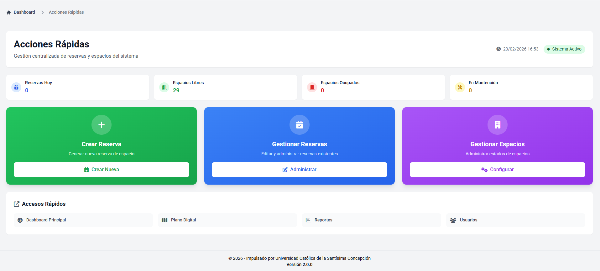

### Panel de Acciones Rápidas

Diseñado para las tareas operativas de alta frecuencia:
* **Resumen de Disponibilidad en Tiempo Real:** Total de reservas del día, espacios libres, ocupados y en mantención.
  
  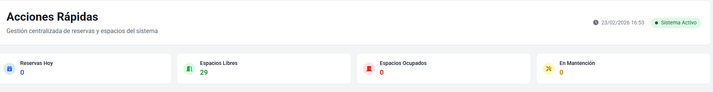

* **Accesos Rápidos de Gestión:**
  
  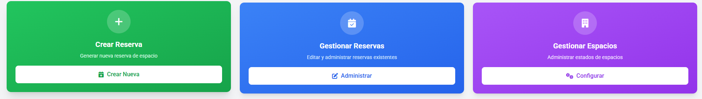
  
  Botones de un clic para crear reserva, gestionar el listado y controlar el estado de las salas.

* **Enlaces Complementarios:**
  
  

---

### Creación de una Reserva Manual

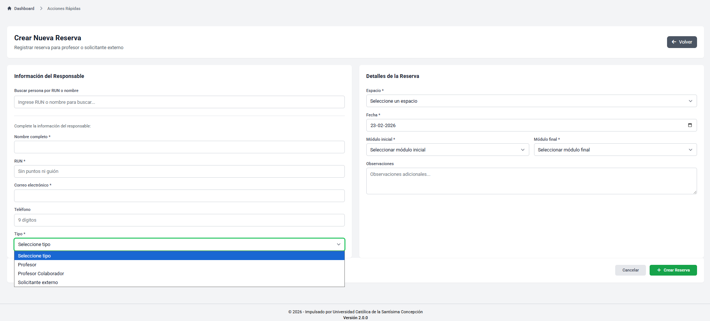

1. En Acciones Rápidas, pulse **Crear Nueva Reserva**.
2. **Identificación del Responsable:** Ingrese el RUN o busque por nombre al solicitante (docente, funcionario o externo). El sistema autocompletará sus datos si ya está registrado.
3. **Selección del Espacio:** Elija el edificio y la sala deseada. El sistema comprobará en tiempo real que no existan colisiones con clases planificadas.
4. **Fecha y Módulos:** Seleccione el día, el módulo de inicio y el módulo de término.
5. **Motivo y Observaciones:** Especifique el propósito de la actividad.
6. **Confirmar:** Haga clic en **Crear Reserva**. El sistema generará el comprobante de asignación.
   
   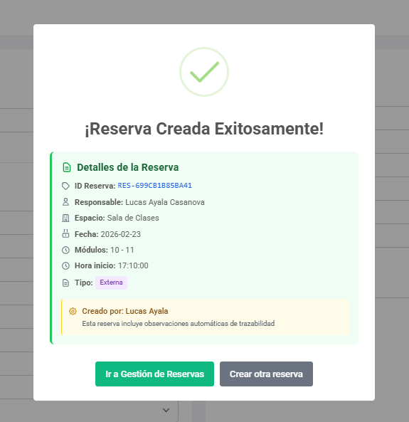

---

### Gestión y Filtros de Reservas

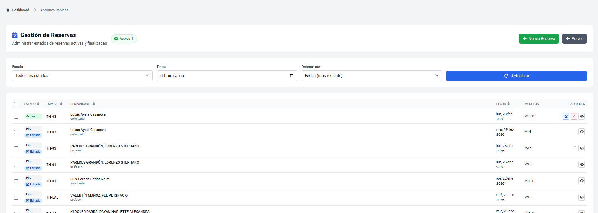

En la tabla de reservas podrá:
* Filtrar por fecha, estado (Activa, Finalizada, Cancelada) o tipo de solicitante.
* **Editar:** Modificar módulos u observaciones de reservas vigentes.
* **Cancelar:** Anular una reserva y liberar de inmediato el espacio reservado.
* **Descargar Comprobante:** Generar el PDF oficial de respaldo.
* **Exportar a Excel:** Descargar planillas completas de auditoría.

---

### Control Operativo de Espacios (Mantenimiento y Bloqueo)

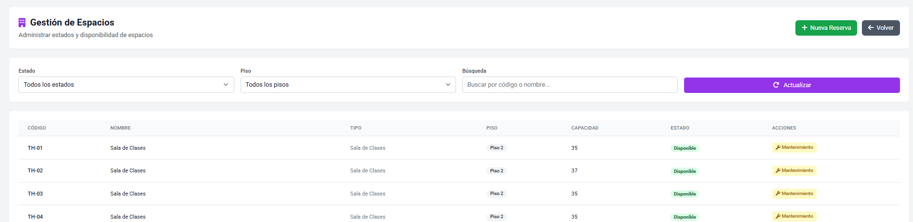

* **Enviar a Mantenimiento:** Inhabilita la sala para reservas por reparaciones, limpieza o falla técnica.
  
  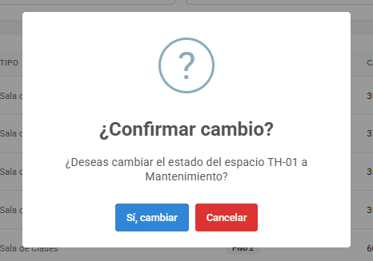

* **Liberar Espacio:** Restablece la sala al estado operativo disponible.
  
  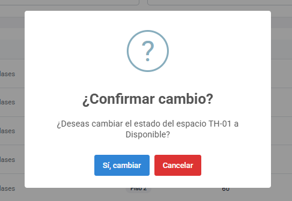
  
  > [!TIP]
  > Es posible liberar un espacio físico que tenga una reserva programada si físicamente ya fue desocupado, manteniendo el registro histórico en el sistema.
  > 
  > 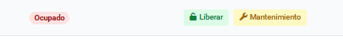

---

## 5. Control Docente y Gestión Académica

Permite la administración de contingencias académicas, licencias docentes y clases fuera de la programación regular.

### Horarios por Espacios y Horarios de Profesores

* **Horarios por Espacio:** Consulte la grilla semanal completa de cualquier sala para planificar actividades libres. Permite exportar la programación a PDF.
* **Horarios Profesores:** Permite revisar la carga académica semanal de cualquier docente de la sede y generar su horario en PDF.

---

### Clases Temporales y Profesores Colaboradores

Para registrar reforzamientos, cursos especiales, charlas o talleres temporales:

1. Diríjase a **Control Docente > Clases Temporales** y pulse **Nueva Asignatura Temporal**.
   
   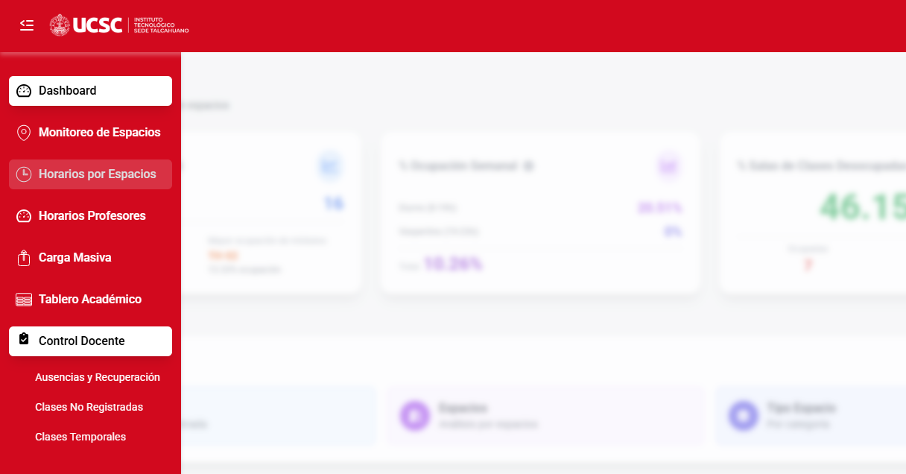
   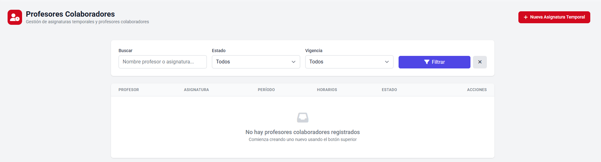

2. Busque o registre los antecedentes del docente a cargo.
   
   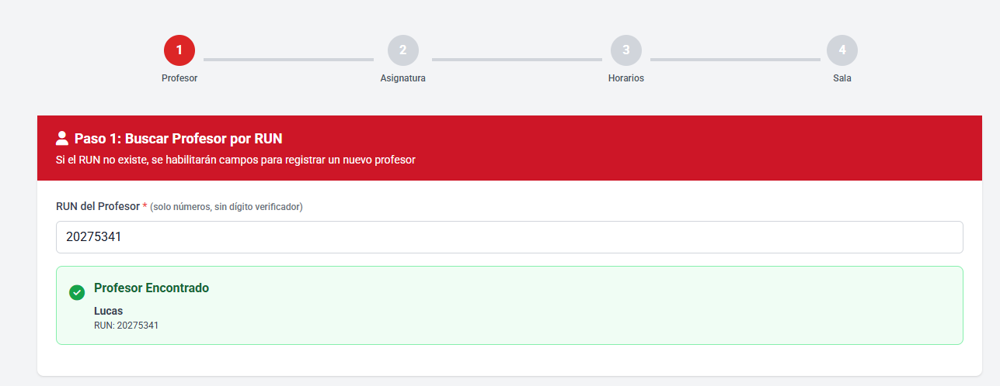
   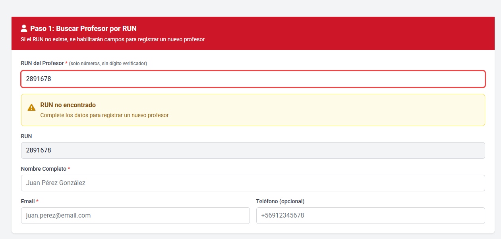

3. Indique el nombre de la actividad, fechas y módulos horarios en los que se impartirá.
   
   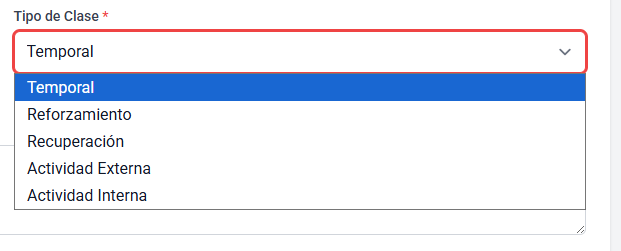
   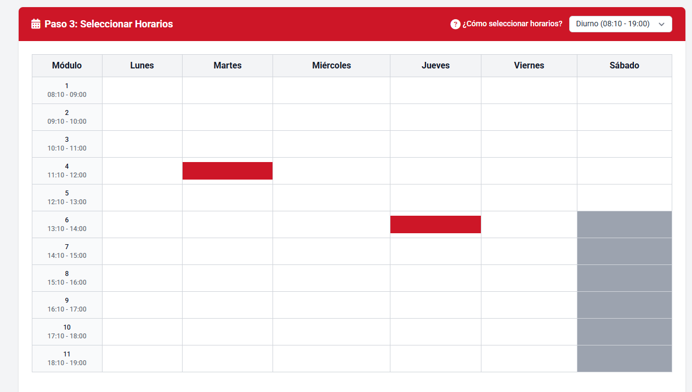

4. Seleccione un espacio disponible sugerido por el sistema.
   
   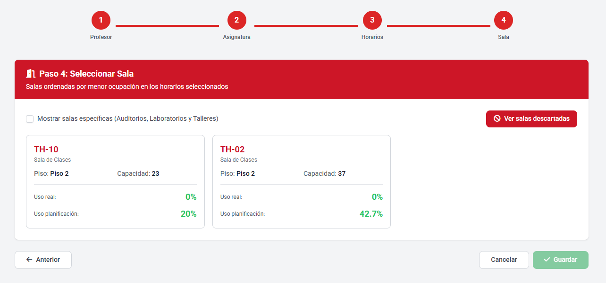

5. Guarde la planificación temporal. El espacio quedará reservado automáticamente en los bloques definidos.

---

### Registro de Ausencias y Licencias Docentes

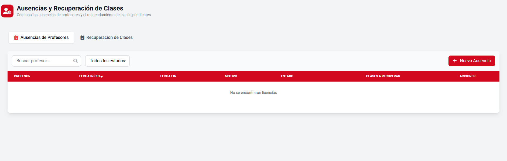

Cuando un profesor presente licencia médica, permiso administrativo o aviso de inasistencia:
1. Acceda a **Control Docente > Ausencias y Recuperación**.
2. Haga clic en **Nueva Ausencia**.
3. Seleccione al docente, el rango de fechas o módulos afectados y el motivo justificado.
4. Al guardar, AulaSync **libera automáticamente las salas** asociadas a las clases del docente durante ese período, evitando que figuren bloqueadas.

---

### Planificación de Recuperación de Clases

1. En la pestaña **Recuperación de Clases**, el sistema listará todas las sesiones pendientes de recuperar producto de ausencias registradas.
2. Seleccione la sesión y pulse **Reagendar**.
3. El sistema verificará la disponibilidad horaria del docente y sugerirá salas libres para la nueva fecha elegida.
4. Una vez guardada, la recuperación se incorpora a la programación semanal y se notifica al docente.

---

## 6. Dashboard, Analítica y Reportes

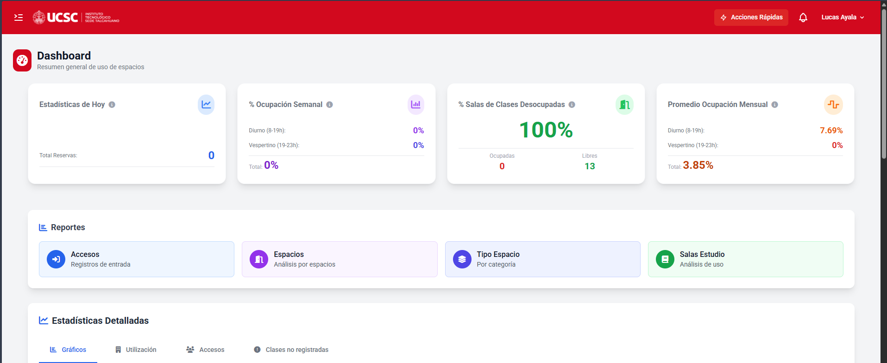

### Indicadores Clave de Desempeño (KPIs)

En la parte superior del Dashboard encontrará métricas de la sede en tiempo real:

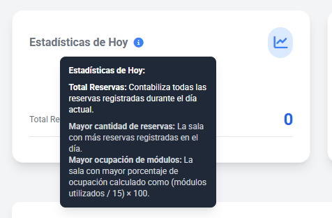

* **Total de Reservas y Sala Más Utilizada:** Monitoreo del volumen de actividad y puntos de mayor congestión.
* **Porcentaje de Ocupación Semanal:** Desglosado en jornada **Diurna** y **Vespertina**.
* **Salas Desocupadas Actualmente:** Disponibilidad instantánea para reasignaciones rápidas.
* **Promedio Mensual de Ocupación:** Tendencia global de uso de la infraestructura.

---

### Gráficos Analíticos Interactivos

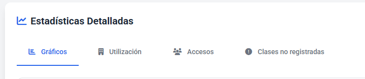

* **Filtros Temporales:** Permite acotar las estadísticas por semana actual, mes o rangos personalizados de fechas.
  
  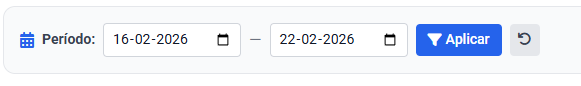

* **Vistas por Categoría y Zoom:** Alterne entre tipos de espacios y haga zoom con el ratón o trackpad sobre picos de demanda.
  
  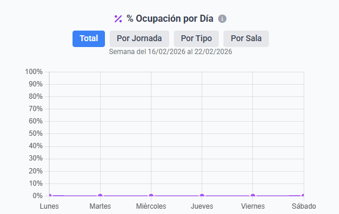
  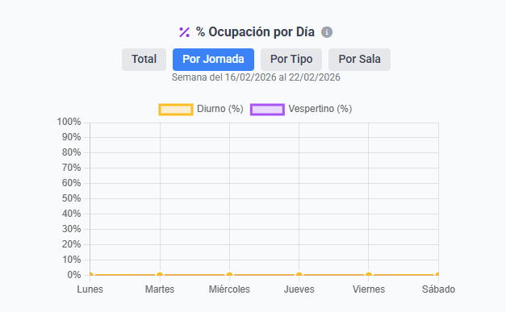

* **Historial de Accesos:** Panel en vivo con las reservas activas y los últimos movimientos registrados.
  
  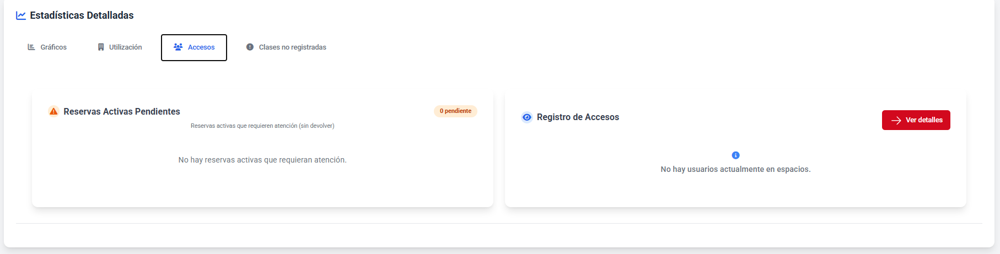

---

### Monitoreo de Clases No Realizadas

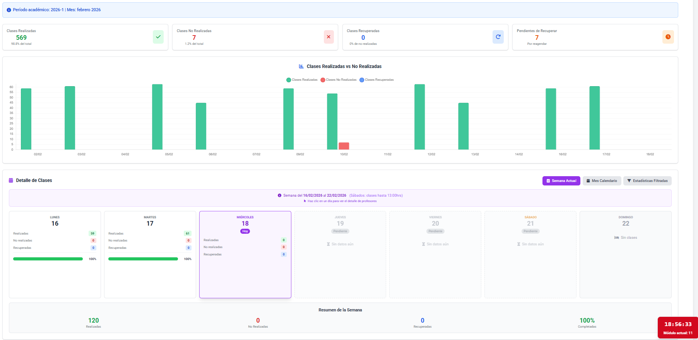

Permite auditar el cumplimiento de la programación docente cruzando la planificación oficial contra las aperturas de sala:
* Al hacer clic en un día del gráfico, se despliega el listado pormenorizado de clases que no se impartieron:
  
  

* Puede cambiar la granularidad temporal entre semana actual, mes o rango manual:
  
  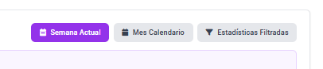
  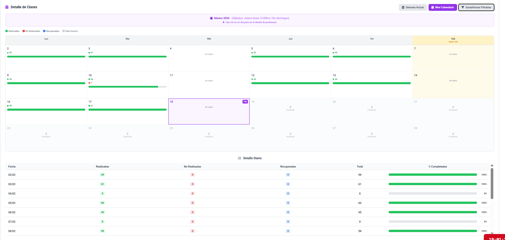
  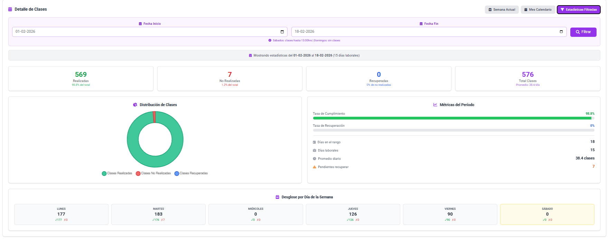

* **Módulos Actuales y Clases No Realizadas Hoy:** Listados rápidos para contactar de inmediato al docente ante un retraso.
  
  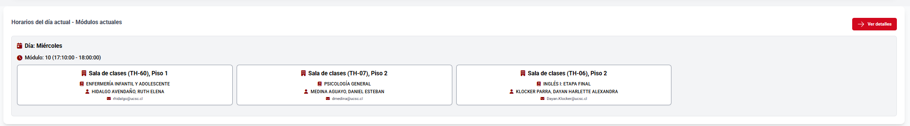
  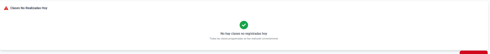

---

### Módulo de Reportes Especializados

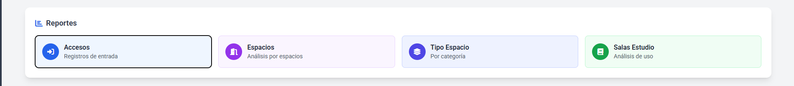

Desde el menú de reportes es posible generar informes descargables en formatos Excel y PDF:
1. **Reporte de Accesos:** Auditoría exhaustiva de entradas, salidas y responsables.
2. **Reporte de Espacios:** Frecuencia de uso y horas efectivas por aula o laboratorio.
3. **Reporte por Tipo de Espacio:** Comparativa entre salas de clases, laboratorios de computación, talleres y auditorios.
4. **Reporte de Salas de Estudio:** Ocupación, duración de sesiones y cantidad de estudiantes atendidos.
5. **Reporte de Uso de Auditorio:** Registro de eventos institucionales y capacidad utilizada.

---

## 7. Carga Masiva y Calendario Académico

### Carga Masiva de Planificaciones (Excel)

Este módulo (restringido a administradores) permite importar la programación académica semestral institucional:
1. Ingrese a **Carga Masiva** en el menú lateral.
2. Seleccione el **Período Académico** (por ejemplo: `2026-1`).
3. Suba el archivo Excel oficial con las columnas estandarizadas de asignaturas, docentes, salas y bloques horarios.
4. El sistema ejecuta una validación previa de consistencia:
   * Verifica la existencia de salas y docentes.
   * Alerta sobre posibles choques de horario.
5. Confirme el procesamiento. Una barra de progreso indicará el avance de la carga.

> [!IMPORTANT]
> Cada carga masiva realiza una limpieza atómica previa del período seleccionado para evitar duplicidades de planificaciones anteriores.

---

### Mantenedor de Calendario y Días Feriados

Para asegurar que las clases no figuren falsamente como "no realizadas" durante feriados o recesos:
1. Acceda a **Mantenedores > Días Feriados**.
2. El sistema sincroniza automáticamente los feriados oficiales nacionales de Chile.
3. Los administradores pueden añadir feriados institucionales extraordinarios, aniversarios o suspensiones de actividades con un solo clic.

---

## 8. Comunicaciones y Soporte Técnico

### Sistema de Tickets de Soporte Técnico

Integrado directamente en la plataforma (`/soporte`) para resolver dudas e incidencias de infraestructura:
* **Crear Ticket:** Indique el tipo de requerimiento (Falla en proyector, problema en cerradura, discrepancia de horario, duda del sistema).
* **Seguimiento:** Los técnicos y administradores pueden responder, adjuntar antecedentes, reasignar el caso o cambiar el estado (Abierto, En Proceso, Resuelto, Cerrado).
* **Reapertura:** Si el problema persiste, el usuario puede reabrir el ticket con un comentario adicional.

---

### Módulo de Correos Masivos

Herramienta centralizada (`/correos-masivos`) para coordinadores y administradores:
* Permite enviar comunicados a grupos específicos (Docentes de una facultad, Asistentes Académicos, Jefes de Carrera o destinatarios externos).
* Permite programar informes semanales automáticos de clases no realizadas a directivos.
* Uso de plantillas con variables dinámicas que personalizan el saludo, asignatura y fecha de cada destinatario.

---

## 9. Administración y Mantenedores del Sistema

Los mantenedores constituyen la base estructural de AulaSync y están reservados para usuarios con permisos administrativos:

### Estructura Institucional y Académica
* **Universidades, Sedes y Campus:** Definición de los recintos y parámetros generales de la institución.
* **Facultades y Escuelas:** Agrupación orgánica de carreras y departamentos.
* **Carreras y Áreas Académicas:** Catálogo de planes formativos impartidos en la sede.
* **Jefes de Carrera y Asistentes Académicos:** Asignación de coordinadores responsables de cada programa.

---

### Infraestructura Física y Mapas
* **Pisos:** Configuración de niveles por edificio.
* **Espacios:** Alta, edición y configuración de capacidades máximas, tipo de recinto (Sala, Lab, Taller, Auditorio) y código QR descargable por sala.
* **Editor de Mapas:** Subida de planos vectoriales y vinculación de bloques interactivos a cada aula física.

---

### Seguridad y Control de Acceso
* **Gestión de Usuarios:** Creación de cuentas, asignación de sedes autorizadas y activación de credenciales.
* **Roles y Permisos:** Administración granular basada en Spatie Laravel Permission para definir exactamente qué botones y vistas puede operar cada perfil.
